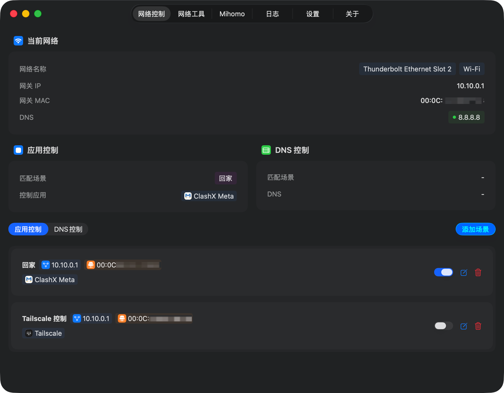
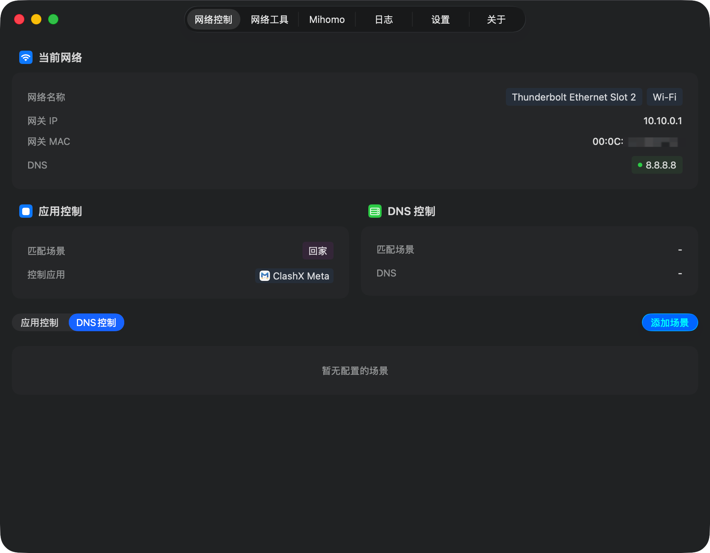
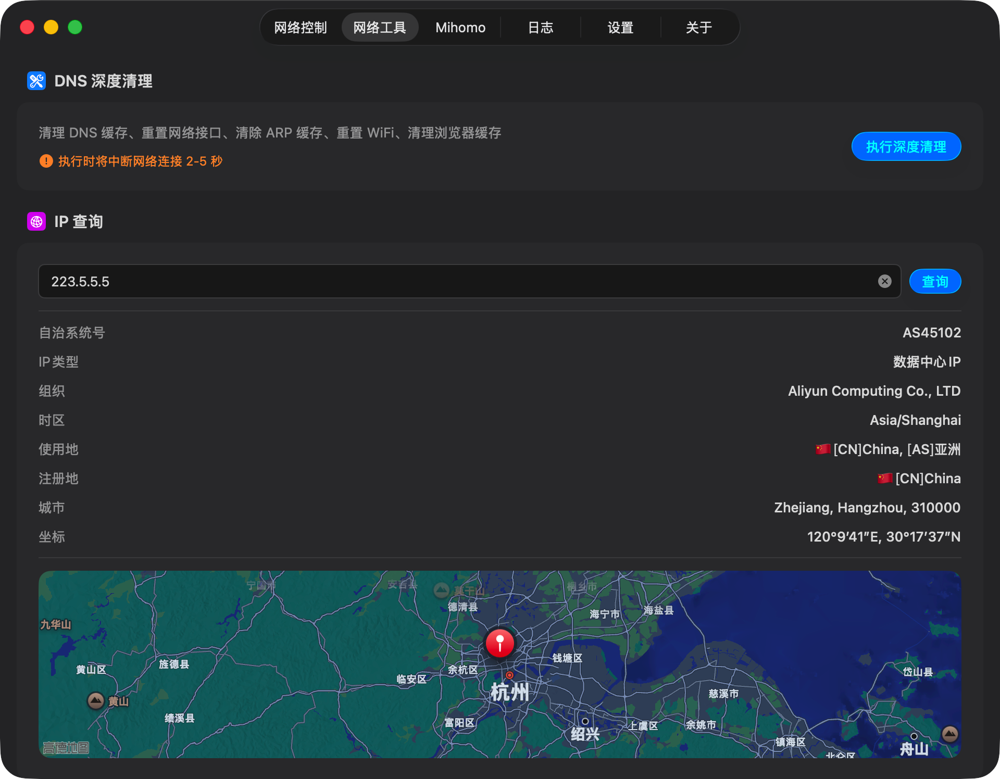
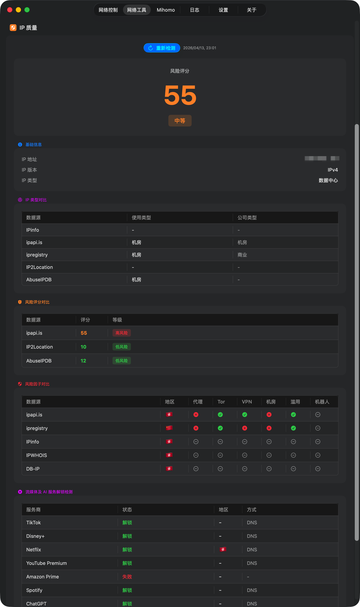
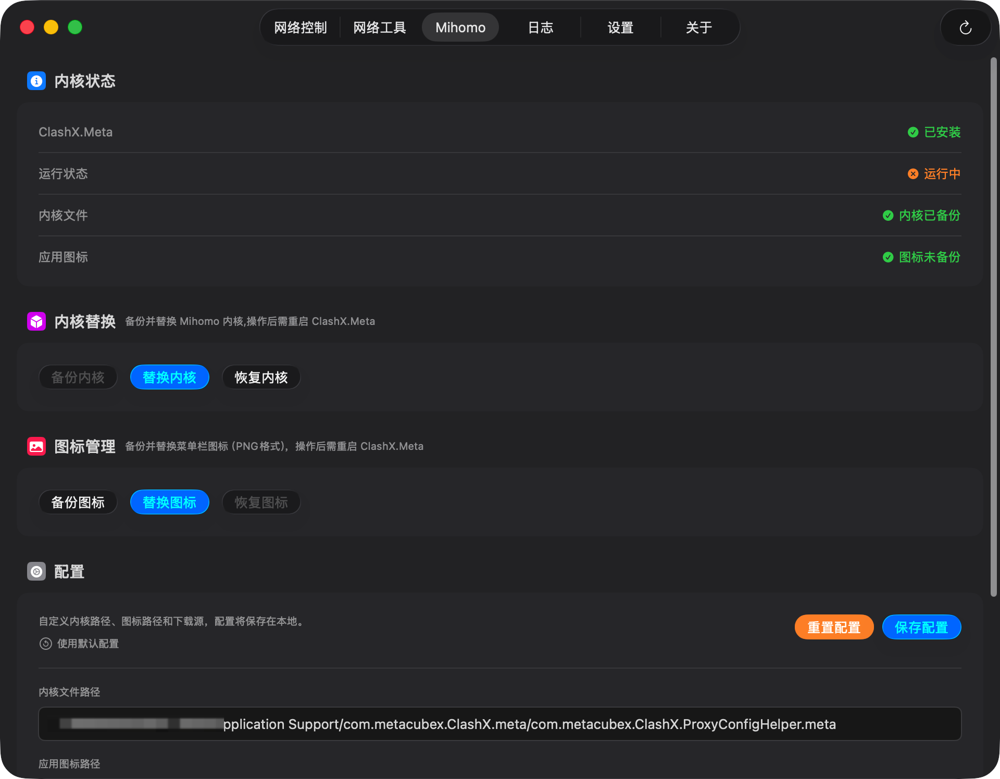

# NetCue

**一个住在菜单栏里的网络自动化工具。**

切换网络、换 DNS、查 IP、检测代理风险，全都在一个地方搞定。不需要每次手动改配置，设好场景规则，NetCue 自动帮你做。

<br>

## 它能干什么

### 网络场景自动切换
按 Wi-Fi 名字、IP 段或者 DNS 特征，自动识别你当前在哪个网络环境，然后执行你预先配好的动作——比如连公司 Wi-Fi 就自动开代理，回家就自动关。



### DNS 管理
不用开终端，直接在界面里切换系统 DNS。支持自定义场景，不同网络环境用不同 DNS，自动切。



### IP 查询
输入任意 IP，聚合多个数据源（IPinfo、DB-IP、IPWHOIS 等）一次性查出归属地、ISP、坐标，还会在地图上标出来。



### 隐私检测
检测当前 IP 的代理风险评分，包括是否被标记为数据中心、VPN、Tor、垃圾邮件来源等，支持流媒体解锁检测。



### Mihomo 快速配置
针对 ClashX.Meta 用户，提供内核版本管理、一键替换内核、菜单栏图标自定义等功能，省去手动替换文件的麻烦。



### 应用控制
场景切换的时候，顺带管一下应用——比如到家自动打开某个 App，进公司网络自动退出另一个。

<br>

## 安装

> **系统要求**：macOS 15.0 (Sequoia) 及以上

1. 前往 [Releases](../../releases) 页面，下载最新的 `.dmg` 文件
2. 双击挂载，把 **NetCue.app** 拖到 Applications 文件夹
3. 由于没有 Apple 公证，首次安装需要在终端执行一下：
   ```bash
   sudo xattr -rd com.apple.quarantine /Applications/NetCue.app
   ```
4. 打开 NetCue，进入 **设置** → 点击 **安装 Helper**（需要输入密码，用于 DNS 管理等需要权限的操作）

<br>

## 从源码构建

**环境要求**

- macOS 15.0+
- Xcode 16+
- 一个 Apple ID（免费账号即可）

**步骤**

1. Clone 仓库
   ```bash
   git clone https://github.com/你的用户名/NetCue.git
   cd NetCue
   ```

2. 用 Xcode 打开 `NetCue.xcodeproj`，在 **Signing & Capabilities** 里把 Team 改成你自己的 Apple ID

3. 更新 Helper 的安全校验字符串，把两个文件里的占位符换成你自己的 Apple ID 和 Team ID：

   **`NetCue/Info.plist`**
   ```xml
   <string>identifier "...helper" and anchor apple generic and certificate leaf[subject.CN] = "Apple Development: YOUR_APPLE_ID@example.com (YOUR_TEAM_ID)" ...</string>
   ```

   **`NetCueHelper/Info.plist`**
   ```xml
   <string>identifier "...NetCue" and anchor apple generic and certificate leaf[subject.CN] = "Apple Development: YOUR_APPLE_ID@example.com (YOUR_TEAM_ID)" ...</string>
   ```

   > 你的 Team ID 可以在 Xcode → Settings → Accounts 里看到，也可以跑 `security find-identity -v -p codesigning` 查。

4. 直接在 Xcode 里 Build & Run 就行了

<br>

## 关于 API Key

IP 查询和隐私检测功能依赖第三方数据源，部分服务有免费额度，不配置也能用基础功能。如果查询量比较大，可以在 **设置 → API Key 配置** 里填入自己的 Key：

| 服务 | 免费额度 | 用途 |
|------|---------|------|
| [IPinfo](https://ipinfo.io) | 5万次/月 | IP 归属地 |
| [ipapi.is](https://ipapi.is) | 1000次/天 | IP 信息 |
| [AbuseIPDB](https://www.abuseipdb.com) | 1000次/天 | 风险评分 |
| [IP2Location](https://www.ip2location.com) | 有免费套餐 | IP 精确定位 |
| [ipregistry](https://ipregistry.co) | 1万次免费 | 综合信息 |

<br>

## License

[MIT](LICENSE) © 2025-2026 SlippinDylan Studio
